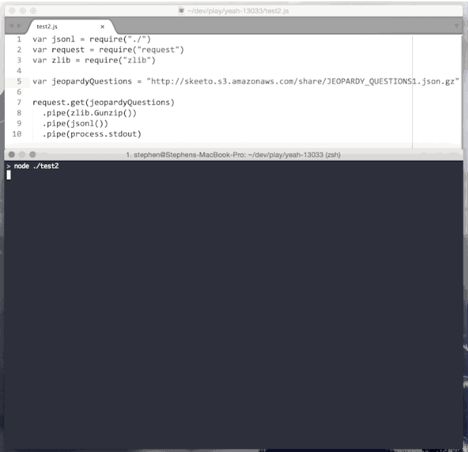

# jso\nl

> Transform a stream of JSON into a stream of [Line Delimited JSON](http://en.wikipedia.org/wiki/Line_Delimited_JSON)

## Install
```sh
$ npm install --save jsonl
```

## Use
```js
var jsonl = require("jsonl")
var request = require("request")
var zlib = require("zlib")

var jeopardyQuestions = "http://skeeto.s3.amazonaws.com/share/JEOPARDY_QUESTIONS1.json.gz"

request.get(jeopardyQuestions)
  .pipe(zlib.Gunzip())
  .pipe(jsonl())
  .pipe(process.stdout)
```



## API

### var jsonl = require("jsonl")([opts])

#### opts.depth
- Type: `Number` (default: `1`)

The depth of the objects in the incoming data to pluck out. This is what you want for an array of objects, such as:

```json
[{"this":"that"},{"this":"that"}]
```

#### opts.objectMode
- Type: `Boolean` (default: `false`)

Convert data into an object stream.

#### opts.separator
- Type: `String` (default: `\n`)

String to separate object data with.

## License

MIT © [Stephen Sawchuk](http://stephenplusplus.com)